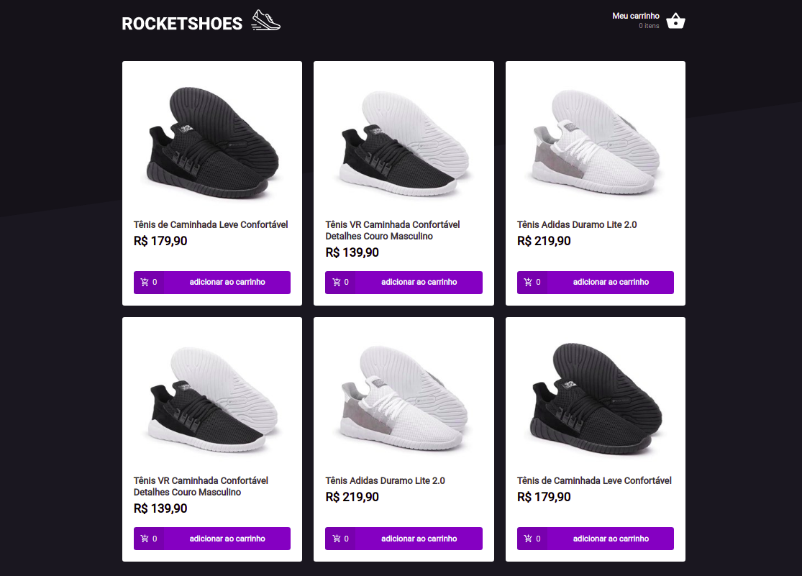

# Rocketshoes

     

## Project Overview

"Rocketshoes" is a simple shopping cart built with React, Redux and Redux-Saga

## Run Locally

-   Clone this repository and go into its src folder.
-   Run `yarn`
-   Run `yarn start`
-   Run `json-server server.json -p 3333 -w`
-   Go to `http://localhost:3000` to view the app.
